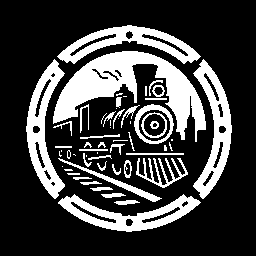

[](https://opensource.org/licenses/BSD-3-Clause)

<p align="center">
    
</p>

# eisenbahn WORK IN PROGRESS!!!!
A fully UDP-based client-server game networking system developed in Rust.

## Installation
To install, add the following to your `Cargo.toml` file:
```toml
[dependencies]
eisenbahn = "0.1.0"
```

## Features
 - **Encryption Options:**
    - None
    - AES128-GCM
    - AES256-GCM
    - ChaCha8Poly1305
    - ChaCha20Poly1305
 - **Flexible Client Authentication:**
    - Username only
    - Username and password
    - ed25519 public/private key (ed255129 signature)
    - Central Authority (for most commercial use)
 - **Optional Server Authentication:**
    - Based on ed25519 signatures
 - **Connection Management:**
    - Rejection based on client version
    - User-defined connection rejection (e.g., player bans)
 - **API Interface:**
    - Poll-based and blocking
 - **System Performance:**
    - Runs on a dedicated thread
    - Latency (Ping) discovery
    - Timeout detection
 - **Messaging System:**
    - 4 virtual reliable ordered message channels
    - Unreliable unordered messages NOT YET IMPLEMENTED
    - Bypassing congestion control for ultra low latency NOT YET IMPLEMENTED
    - Decaying unreliable unordered messages NOT YET IMPLEMENTED
 - **Efficiency:**
    - Thread efficiency in idle state (the network thread does not poll in fixed intervals) NOT YET IMPLEMENTED
 - **Safety:**
    - 100% safe Rust (excluding dependencies)

## Contribution
Unless you explicitly state otherwise, any contribution intentionally submitted for inclusion in the work by you shall be under the terms and conditions of the BSD-3-Clause License, without any additional terms or conditions.